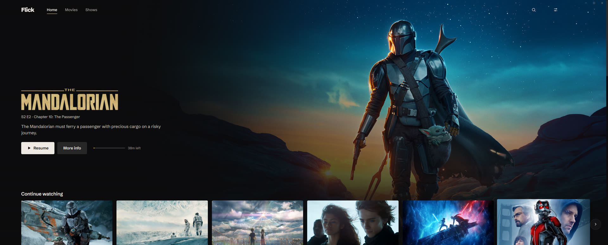
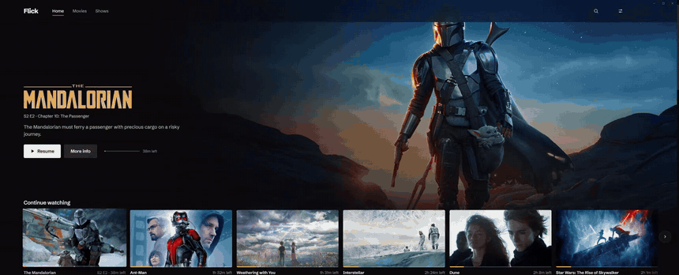
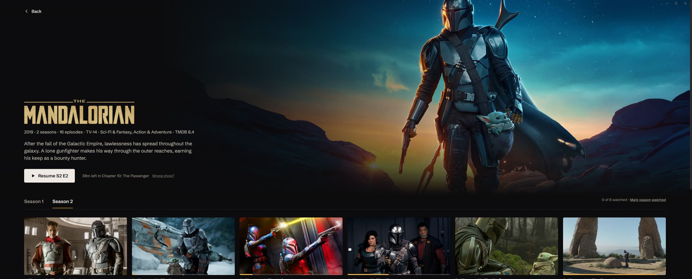
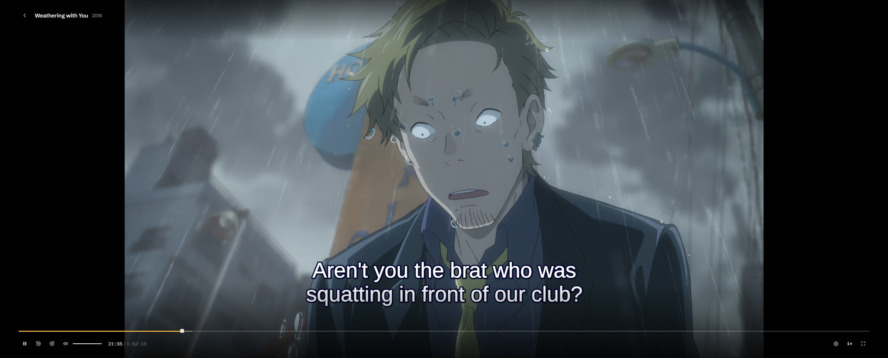
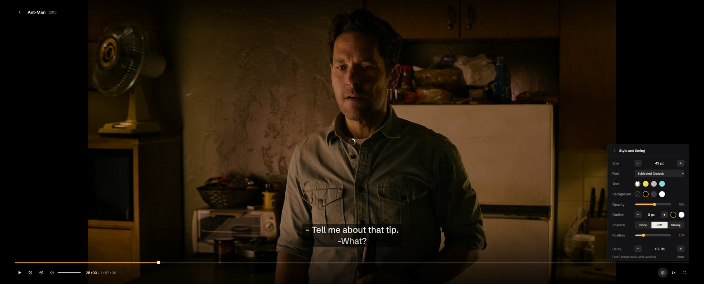
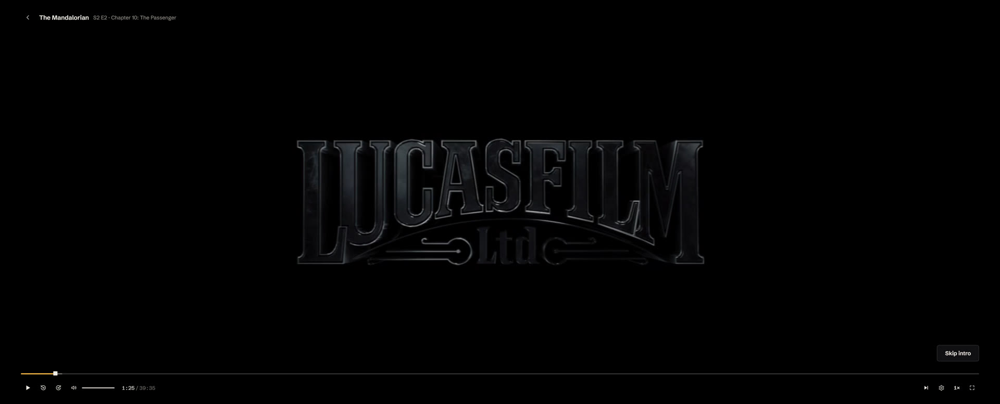
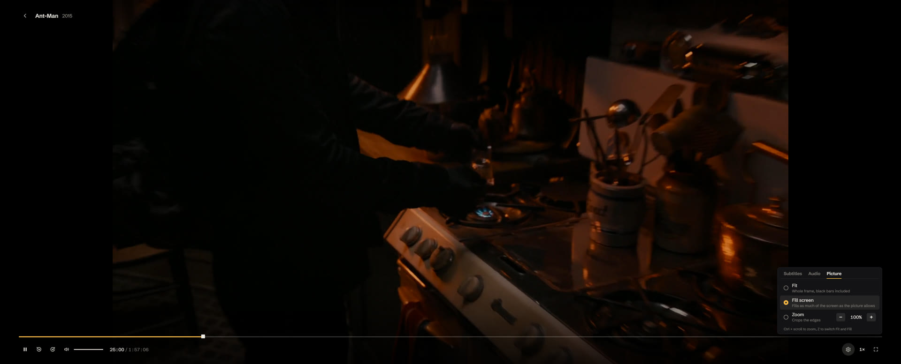
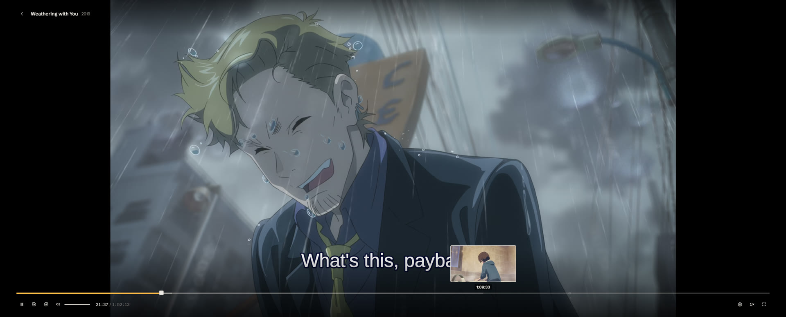
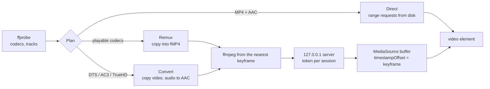

<div align="center">


# Flick

**A Windows app for watching the movies and shows on your own drive.**

Automatic sorting, TMDB artwork, exact seeking on nearly any file, skip intro, and subtitles you can actually tune.

[**Project page**](https://shreywy.github.io/flick/) · [Run it](#run-it) · [How playback works](#how-playback-works)


<br>



</div>

## What it is

I wanted something like a streaming app for the films already sitting in a folder, without running Plex or a Docker container. Flick is a desktop app you open, watch something in, and close. It reads a `Movies` and `TV Shows` folder, fetches the artwork, sorts new downloads into place, and plays files with the same seek precision as a local MP4, even when the audio has to be converted on the fly.

It was designed on a 3440x1440 ultrawide and scales down to normal screens.

<div align="center">
  
  <br><sub>The card you click flies to the middle of the screen and the player opens out of it. Going back runs it in reverse.</sub>
</div>

## Highlights

<table>
  <tr>
    <td width="50%"></td>
    <td width="50%"></td>
  </tr>
  <tr>
    <td><b>Library with real artwork.</b> Posters, backdrops, logos, cast and episode stills from TMDB, saved next to the files so they're fetched once.</td>
    <td><b>Plays nearly anything.</b> Video is copied untouched; DTS, AC3, TrueHD and 5.1 Opus audio is converted to AAC while it plays. Styled anime subtitles go through libass.</td>
  </tr>
  <tr>
    <td></td>
    <td></td>
  </tr>
  <tr>
    <td><b>Subtitles you can tune.</b> Size by the pixel, font, colours, background opacity, outline, shadow, height and delay. Missing ones can be downloaded from OpenSubtitles or SubDL mid-film.</td>
    <td><b>Skip intro and credits.</b> Found by comparing an episode's audio with its neighbours (Chromaprint), so no chapter markers are needed.</td>
  </tr>
  <tr>
    <td></td>
    <td></td>
  </tr>
  <tr>
    <td><b>Ultrawide picture modes.</b> Fill detects burned-in black bars and scales to the screen edges without stretching. Ctrl + scroll zooms by hand.</td>
    <td><b>Seek previews.</b> Frame thumbnails along the seek bar, cut from keyframes in one ffmpeg pass.</td>
  </tr>
</table>

Also: new downloads are renamed and moved into the right folder on launch, Continue watching resumes paused where you stopped, search matches titles, cast and directors as you type, and right-clicking anything gives a menu for it.

## Tech stack

| Layer | What | Why it's there |
|---|---|---|
| Shell | **Electron 44** | Frameless window with its own controls, one instance at a time |
| Interface | **React 19**, **TypeScript** (strict) | Hash router, no state library, one stylesheet of design tokens |
| Build | **Vite** + **esbuild** | Renderer and main process build in under two seconds |
| Storage | **node:sqlite** | Progress, settings and the sorting queue in one file, no native modules |
| Video | **ffmpeg / ffprobe** + **Media Source Extensions** | Remux and audio conversion streamed as fragmented MP4, with exact seeking |
| Audio matching | **Chromaprint** | Fingerprints for intro and credits detection |
| Subtitles | **JASSUB** (libass in WebAssembly) | Styled ASS subtitles with their original fonts, colours and positioning |
| Motion | **View Transitions API** | Card-to-player animations over the real page |
| Data | **TMDB**, **OpenSubtitles**, **SubDL** | Metadata, artwork, subtitle search |
| Secrets | **Electron safeStorage** | API keys encrypted with the Windows user's credentials |
| Tests | **Vitest**, **Playwright** | 34 unit tests, end-to-end scenarios against the built app |

## How playback works

A stream piped out of ffmpeg normally can't be seeked: the browser sees a file of unknown length that starts at zero. Flick gets around that by placing each stream at its real position in the film.



Seeking inside what's already buffered is instant. Seeking further away starts a new ffmpeg process at the nearest keyframe, which takes about a second and a half on a 1080p file. The buffer stays at most 90 seconds ahead of playback and drops what's well behind.

**Intro detection** fingerprints the first six minutes and last seven minutes of an episode and its neighbours, then slides the fingerprints against each other looking for the longest run of near-identical frames. An intro only counts when both neighbouring episodes agree on it, so a "previously on" recap of last week's episode doesn't get mistaken for one.

## Run it

Needs Windows, Node 24, and ffmpeg built with Chromaprint (the gyan.dev full build has it). Flick looks in `C:\Program Files\ffmpeg\bin` by default and you can change that in Settings.

```
git clone https://github.com/shreywy/flick
cd flick
npm install
npm start
```

The first launch asks for a media folder and a TMDB key (free at themoviedb.org). Subtitle downloads need an OpenSubtitles or SubDL key, added in Settings.

`npm run dist` builds `release\win-unpacked\Flick.exe`. Close Flick first or Windows won't let the build replace it.

### Folder layout

```
E:\Media
  Movies\Dune (2021)\Dune (2021).mkv
  TV Shows\The Mandalorian\Season 1\The Mandalorian S01E01.mp4
  Shows and Movies\            new downloads, sorted on launch
```

Each title folder gets a `flick.json` with its metadata. Progress, settings and the queue live in `%APPDATA%\Flick\flick.db`.

## Project structure

```
electron/   main process: library scan, sorting queue, TMDB, subtitles,
            ffmpeg streaming server, crop and intro detection
src/        React interface, the player, MSE feeder, page transitions
shared/     types used by both sides
test/       unit tests (npm test)
e2e/        Playwright runs against the real app (node e2e/run.mjs <scenario>)
site/       the project page
```

The end-to-end scenarios cover more than the happy path: pressing Esc twice, clicking during an animation, scrolling while the player shrinks back into its card, resizing mid-transition, and spamming keys in the player.

---

<sub>Uses the TMDB API but is not endorsed or certified by TMDB. Screenshots show my own library.</sub>
